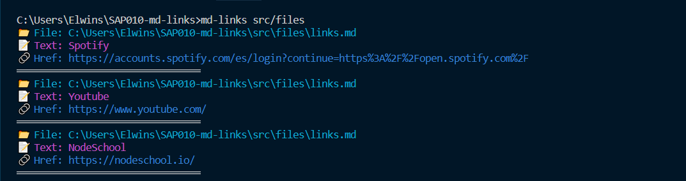
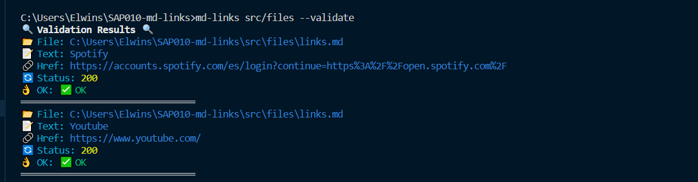
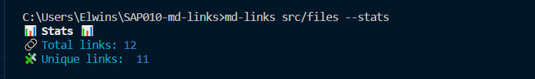
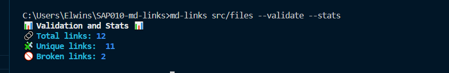
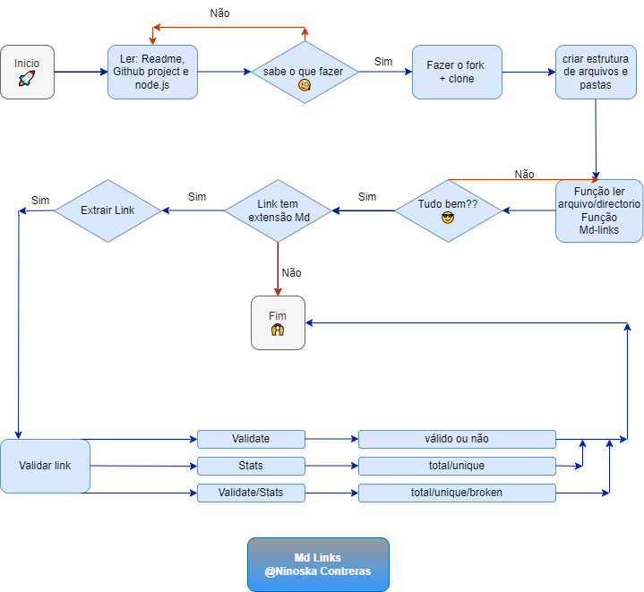
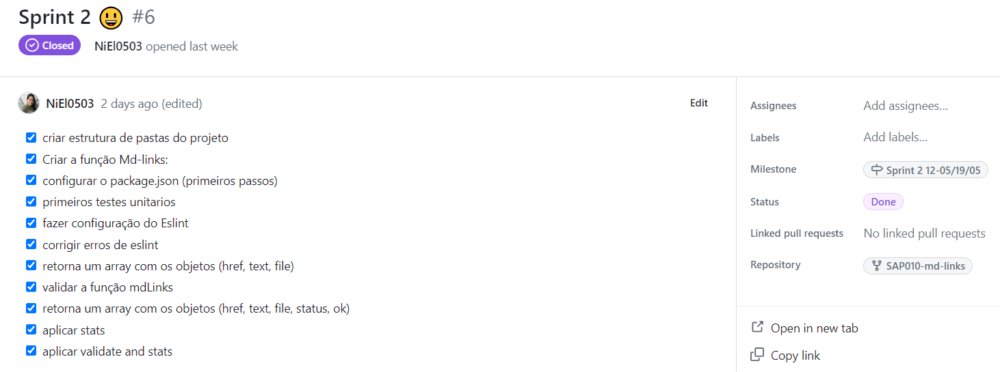
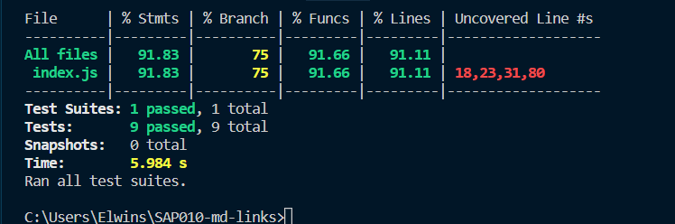

# Markdown Links  &nbsp; 

## Índice

* [1. Prefácio](#1-prefácio)
* [2. Resumo do projeto](#1-Resumo-do-projeto)
* [3. Guia de instalação](#2-Guia-de-instalação)
* [4.Guia de uso ](#3-Guia-de-uso)
* [5. Fluxograma](#5-Fluxograma)
* [6. Tecnologias Utilizadas](#6-Tecnologias-utilizadas)
* [7. Ferramenta  de organização](#7-Ferramenta-de-organização)
* [8. Testes](#8-Testes)

***

## 1. Prefácio 📑
[Markdown](https://pt.wikipedia.org/wiki/Markdown) é uma linguagem de marcação muito popular entre os programadores. É usada em muitas plataformas que
manipulam texto (GitHub, fórum, blogs e etc) e é muito comum encontrar arquivos com este formato em qualquer repositório (começando pelo tradicional
`README.md`).

## 2. Resumo do projeto 💻

Esta é uma biblioteca NodeJS que contém um extrator de links, recebe um caminho de arquivo no formato `Markdown` ".md" e retorna via console uma lista de todos os links que o projeto contém, bem como o caminho e o texto. Além disso, se a opção `validate` for adicionada, você também pode verificar o status e ok: mensagem de falha em caso de falha ou ok em caso de sucesso. Se você colocar a opção `stats` poderá verificar se os links funcionam ou se não estão "quebrados".
 

## 3. Guia de instalação 📌

Para instalar esta biblioteca você deve executar a seguinte linha de comando: <strong>`npm install md-links-ninoska`</strong>. Este módulo inclui um executável como uma interface que pode ser importada com require.

Após a instalação, certifique de ter um arquivo .md com links dentro.
 

## 4. Guia de uso ⌨️

a) Rode o comando <strong>`mdlinks` + o caminho do seu arquivo </strong>, para obter o retorno do caminho (file), texto (text) e o link do arquivo selecionado (href). 
Exemplo:
`md-links <caminho-do-arquivo>`

  

b) Se além de obter o caminho (file), o link (href) e o texto (text) você deseja realizar uma validação destes, utilize a propriedade <strong>--validate</strong>, para que desta forma obtenha o status da sua requisição HTTP (status) e uma mensagem com a aprovação ou rejeição do seu link (ok).  
🔎  observação: se o link resultar em um redirecionamento a uma URL que responde ok, então consideraremos o link como ok. 
Exemplo:
 `md-links <caminho-do-arquivo> --validate`
 

c) Se você quiser saber as estatísticas desses links, pode digitar a opção <strong>--stats</strong> e a saída será um texto com estatísticas básicas sobre os links, onde você encontrará as informações sobre o número total de links e quantos são únicos. 
Exemplo:
`md-links <caminho-do-arquivo> --stats`

d) Também é possível combinar ´--validate´ e ´--stats´ para obter o número total de links, quantos são únicos e quantos estão quebrados.
Exemplo: `md-links <caminho-do-arquivo> --validate --stats`.  

## 5. Fluxograma 
Fluxograma utilizado na realização deste projeto  

## 6. Tecnologias Utilizadas

## 7. Ferramenta  de organização

Para a organização deste projeto, trabalhe com o Github Project. 
Dividi cada Milestone em um sprint e, por sua vez, dentro de cada sprint, diferentes issues foram criados

 

## 8. Testes 

Para realizar os testes, trabalhe com Jest, que é uma estrutura de teste unitário  de código aberto em JavaScript, obtendo os seguintes resultados:  

